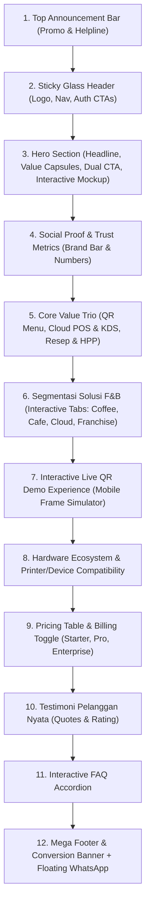

# DESAIN.md — Panduan Desain & Arsitektur UI/UX Landing Page OQARI

> Panduan Sistem Desain, Tokens, Struktur Komponen, Interaktivitas, dan Responsivitas Landing Page OQARI (Terinspirasi oleh Standar Industri Majoo.id dengan Identitas F&B Kopi Modern).

---

## 1. Filosofi & Arah Visual

Landing page OQARI memadukan estetika *Modern Specialty Coffee Culture* (hangat, elegan, profesional, dan menggugah selera) dengan *High-Tech SaaS Precision* (bersih, responsif, cepat, dan terpercaya).

### Karakteristik Visual:
- **Warm & Sophisticated**: Nuansa warna kopi kaya (deep espresso, roasted amber, soft latte cream) berpadu dengan aksen emerald segar untuk mencerminkan pertumbuhan bisnis dan status operasional aktif.
- **Glassmorphism & Depth**: Penggunaan soft backdrop-blur, subtle borders, dan ambient shadow untuk memberikan kesan modern ala iOS/macOS dan platform SaaS kelas dunia.
- **Micro-Interactions**: Hover lifts halus, transisi tab tanpa reload (didukung Alpine.js), dan mockup interaktif yang hidup.

---

## 2. Design Tokens & Palet Warna

```css
:root {
    /* Brand Primary - Espresso & Roast */
    --color-brand-primary: #1C1917;       /* Dark Espresso Charcoal */
    --color-brand-secondary: #78350F;     /* Rich Amber Roast */
    --color-brand-accent: #D97706;        /* Warm Caramel / Golden Foam */
    --color-brand-light: #FEF3C7;         /* Warm Latte Cream */
    
    /* Functional Accents */
    --color-emerald-accent: #059669;      /* Growth, Live orders, Online Status */
    --color-emerald-light: #ECFDF5;       /* Mint pill backgrounds */
    
    /* Backgrounds & Neutrals */
    --color-bg-base: #FAFAF9;             /* Stone-50 warm canvas */
    --color-bg-surface: #FFFFFF;          /* Pure white cards */
    --color-border-subtle: #E7E5E4;       /* Stone-200 border */
    --color-text-main: #1C1917;           /* Stone-900 high contrast */
    --color-text-muted: #78716C;          /* Stone-500 secondary body */
}
```

### Gradients Khas:
- **Hero Mesh Gradient**:
  `radial-gradient(ellipse at 80% 20%, rgba(217, 119, 6, 0.15) 0%, transparent 60%), radial-gradient(ellipse at 20% 80%, rgba(5, 150, 105, 0.1) 0%, transparent 50%), #FAFAF9`
- **Pill & Capsule Button Gradient**:
  `linear-gradient(135deg, #78350F 0%, #B45309 50%, #D97706 100%)`

---

## 3. Tipografi

- **Font Keluarga Utama**: `Inter`, `-apple-system`, `BlinkMacSystemFont`, `sans-serif` (sesuai setup Tailwind proyek).
- **Hirarki Tipografi**:
  - `Hero Heading`: 44px - 60px (Font Weight: 800, tracking: -0.025em, line-height: 1.15)
  - `Section Heading (H2)`: 32px - 40px (Font Weight: 700, tracking: -0.02em)
  - `Sub-Heading (H3)`: 20px - 24px (Font Weight: 600)
  - `Body Text (Lead)`: 16px - 18px (Font Weight: 400, line-height: 1.6)
  - `Capsule / Badges`: 11px - 13px (Font Weight: 600, uppercase letter-spacing: 0.05em)

---

## 4. Arsitektur Komponen Halaman

Halaman disusun dalam 12 blok terstruktur:



### Rincian Spesifikasi Sesi:

### 1. Top Announcement Bar
- Banner tipis di paling atas.
- Kiri: Kontak CS / Konsultasi Cepat `0812-8888-OQARI` (atau link WhatsApp).
- Tengah: Badge promo berkilau `"PROMO COFFEE SAAS: Free Setup Onboarding & Diskon 30% Paket Tahunan"`.
- Kanan: Status cloud uptime `"99.98% System Live"`.

### 2. Sticky Glass Header
- `backdrop-blur-md bg-white/80 border-b border-stone-200/80 sticky top-0 z-50`.
- Kiri: Logo OQARI dengan ikon cangkir kopi elegan.
- Tengah: Menu navigasi (`#fitur`, `#solusi`, `#demo-qr`, `#hardware`, `#harga`, `#faq`).
- Kanan:
  - Tombol **"Masuk"** (`route('login')`): Gaya clean minimalis border/ghost.
  - Tombol **"Coba Gratis"** (`route('register')`): Pill button dengan gradient amber-espresso bertekstur, efek glow lembut saat hover.
  - Jika `auth()->check()` aktif: Menampilkan tombol **"Buka Dashboard"** langsung menuju role pengguna.

### 3. Hero Section
- **Sisi Kiri**:
  - Badge kapsul: *"#1 Cloud POS & Smart QR Menu Platform untuk F&B"*.
  - Headline utama: *"Revolusi Bisnis Coffee Shop & Cafe Anda. Pesan dari Meja, Sajikan Lebih Cepat."*
  - Deskripsi ringkas: *"OQARI menyatukan kasir POS, QR menu meja tanpa install aplikasi, kitchen display barista, hingga kalkulasi HPP resep otomatis dalam satu layar."*
  - Capsule tag fitur: `[QR E-Menu Meja]` `[POS Kasir Kilat]` `[KDS Barista]` `[Kalkulasi HPP Kopi]` `[Multi-Outlet]` `[Manajemen Shift]`.
  - Dual CTA Button:
    - Primary: **"Mulai Coba Gratis 14 Hari"** (icon panah kanan) -> `route('register')`.
    - Secondary: **"Lihat Demo Interaktif"** (icon play) -> smooth scroll to `#demo-qr`.
  - Benefit note: *"Tanpa kartu kredit • Setup instan 5 menit • Dukungan teknisi ramah"*.
- **Sisi Kanan (Interactive Visual Showcase)**:
  - Mockup tablet POS & smartphone QR menu yang menampilkan antarmuka real-time:
    - Card pesanan live: *“Table 04 - 2x Caramel Macchiato (Oatmilk, Less Sugar) - CONFIRMED”*.
    - Status badge barista: *“Barista Bar: Sedang Dibuat (1m 20s)”*.
    - Notifikasi total omzet harian: *“Rp 4.850.000 (↑ 24% dari kemarin)”*.

### 4. Social Proof & Trust Metrics Bar
- 4 Counter metrik:
  - **500+** Coffee Shop & Cafe Aktif
  - **3.2 Juta+** Pesanan Diproses Lancar
  - **3x Lebih Cepat** Putaran Meja (Table Turnaround)
  - **99.98%** Server Uptime Berbasis Cloud
- Logo barisan cafe mitra (Artisan Roastery, Kopi Kenangan vibe, Specialty Coffee Labs).

### 5. Core Feature Trio Grid
- Mencontoh pola card grid Majoo dengan layout modern:
  1. **Smart QR E-Menu & Table Self-Ordering**:
     - Pelanggan scan QR code di meja, pilih pesanan, custom topping/milk, dan bayar seketika. Kurangi beban antrean kasir hingga 60%.
  2. **POS Kasir Kilat & Kitchen Display (KDS)**:
     - Antarmuka kasir layar sentuh intuitif. Pesanan langsung terpancar ke layar barista dapur dengan bunyi bell notifikasi tanpa kertas bon hilang.
  3. **Manajemen Resep, Gramasi & HPP Otomatis**:
     - Potong stok biji kopi per 18gr otomatis setiap espresso dibuat. Lacak margin profit tiap cangkir dan peringatan stok menipis.

### 6. Interactive Solution Tabs (Segmentasi Industri)
Didukung Alpine.js (`x-data="{ activeTab: 'coffeeshop' }"`):
- **Tab 1: Specialty Coffee Shop & Roastery**: Fokus pada custom beans, roaster batch tracking, level roasting, dan manual brew flow.
- **Tab 2: Cafe, Resto & Casual Dining**: Split bill, multi-printer (Bar vs Kitchen), reservasi meja, dan servis makanan berurutan.
- **Tab 3: Cloud Kitchen & Coffee Booth**: Kecepatan transaksi grab-and-go, integrasi kurir, dan minimum hardware footprint.
- **Tab 4: Multi-Outlet & Franchise**: Laporan komparasi cabang terpusat, kontrol harga regional, dan manajemen karyawan bertingkat.

### 7. Interactive Live QR Menu Demo (Mobile Simulator)
- Pengunjung web di desktop atau smartphone dapat mengklik simulator menu OQARI:
  - Memilih item: "Spanish Latte", "Aren Creamy Coffee", "Croissant Butter".
  - Memilih modifier: "Oat Milk (+Rp 6.000)", "Extra Espresso Shot (+Rp 5.000)".
  - Melihat subtotal terhitung langsung di layar interaktif.
  - Memberikan pengalaman nyata sebelum mendaftar.

### 8. Hardware & Printer Compatibility
- Daftar perangkat yang didukung:
  - Thermal Printer 58mm & 80mm (Bluetooth, USB, Ethernet LAN).
  - Kasir Terminal All-in-One (Sunmi, iMin, Advan).
  - Tablet Android & Apple iPad.
  - Smartphone Android & iPhone (akses kasir mobile / owner dashboard).
  - Cash Drawer elektrik otomatis buka saat cetak struk tunai.

### 9. Transparent Pricing Matrix
- Switch toggle: **Tagihan Bulanan** vs **Tagihan Tahunan (Hemat 20% + 2 Bulan Gratis)**.
- 3 Tier Paket:
  1. **Starter Barista** (Rp 99.000/bln): Cocok untuk 1 outlet booth / coffee kiosk.
  2. **Pro Coffee House** (Rp 199.000/bln) [POPULAR BADGE]: Semua fitur Starter + QR Meja Unlimited + Barista KDS + Manajemen Resep & HPP.
  3. **Enterprise Multi-Outlet** (Hubungi Sales): Multi-cabang tak terbatas + API Access + Dedicated Account Manager + Onsite Training.

### 10. Testimoni Pemilik Usaha Nyata
- Card testimoni dengan foto pemilik, nama coffee shop, rating 5 bintang, dan kutipan dampak nyata ("Omzet kami naik 35% karena pelanggan tidak kabur melihat antrean panjang di kasir").

### 11. FAQ Accordion Interaktif
- Pertanyaan umum:
  - *Apakah saya harus membeli hardware baru?* (Tidak, bisa pakai tablet/HP lama).
  - *Bagaimana cara pembayaran pelanggan?* (Bisa tunai di kasir, transfer, atau scan QRIS langsung di meja).
  - *Bagaimana jika internet cafe saya mati lampu atau putus?* (POS OQARI memiliki offline-tolerant mode).
  - *Berapa lama waktu yang dibutuhkan untuk memasukkan seluruh menu kami?* (Hanya butuh 5-10 menit, atau tim onboarding kami bantu import via Excel).

### 12. Mega Footer, CTA Penutup & Floating WhatsApp
- CTA banner besar: *"Waktunya Mengubah Coffee Shop Anda Menjadi Mesin Bisnis yang Otomatis & Menguntungkan"*.
- Footer kaya navigasi: Profil perusahaan, alamat Tech Hub, link fitur, terms & privacy.
- Floating WhatsApp button di sudut kanan bawah dengan pulsing ping badge.

---

## 5. Standar Responsivitas & Performa

- **Mobile First Responsive**:
  - Desktop (>1024px): 2-kolom hero, multi-tab horizontal, grid 3 kartu.
  - Tablet (768px - 1023px): Grid 2 kartu, navigasi padat.
  - Mobile (<768px): Single column fluid, horizontal scroll pada pill filter, sticky CTA bar teroptimasi.
- **Zero CLS (Cumulative Layout Shift)**: Aspek rasio gambar & placeholder terdefinisi.
- **Semantic HTML & SEO Ready**: Meta OpenGraph, Twitter Cards, Schema.org LocalBusiness & SoftwareApplication data.
